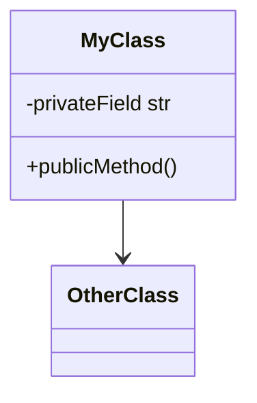

# FAQ - Frequently Asked Questions & Tips

Quick answers to common Claude Code questions.

**Access**: Use `/faq` skill or read this file directly.

---

## Q: How do I scroll up/down in Claude Code terminal without a mouse?

**A:** Use `Ctrl + Shift + Page Up/Down` to scroll in the terminal.

| Action | Shortcut |
|--------|----------|
| Scroll up | `Ctrl + Shift + Page Up` |
| Scroll down | `Ctrl + Shift + Page Down` |

**Why this works**: Claude Code intercepts standard terminal scroll shortcuts, so the `Ctrl + Shift` modifiers are needed. Works in Windows Terminal, PowerShell, and WSL.

---

## Q: How do I view Mermaid diagrams in the live editor?

**A:** Use the `view-mermaid-live.py` script to open diagrams directly in Mermaid Live - **no pasting required!**

### Quick Usage
```bash
python3 ~/.claude/scripts/view-mermaid-live.py diagram.mmd
```

### What It Does
1. Reads your `.mmd` file
2. Encodes diagram directly in the URL (base64)
3. Opens browser with diagram **already loaded**
4. No clipboard, no pasting needed!

### Examples
```bash
# View any Mermaid file - opens with diagram ready!
python3 ~/.claude/scripts/view-mermaid-live.py architecture.mmd
python3 ~/.claude/scripts/view-mermaid-live.py classes.mmd

# Also copy to clipboard as backup
python3 ~/.claude/scripts/view-mermaid-live.py diagram.mmd --copy
```

### How It Works
The script encodes your diagram in the URL:
```
https://mermaid.live/edit#base64:ENCODED_DIAGRAM_JSON
```
Mermaid Live reads the URL and loads the diagram automatically.

**Files**:
- **Script**: `~/klauspython/kc/scripts/view-mermaid-live.py`
- **Symlink**: `~/.claude/scripts/view-mermaid-live.py`

### Mermaid Syntax Tips (avoid errors)

If you get "Syntax error" in Mermaid Live:

| Problem | Wrong | Right |
|---------|-------|-------|
| Underscores in class names | `Coordinate_System` | `CoordinateSystem` |
| Stereotypes | `<<pydantic>>` | Remove or use comment |
| Colon in values | `Domain: Wind_Opt` | `Domain Wind Opt` |
| Special chars | `100%`, `>`, `<` | Avoid or escape |

**Safe template:**


---

## Q: What is the tool for asking multiple choice questions?

**A:** `AskUserQuestion`

This built-in Claude Code tool presents interactive questions with 2-4 options. Users can always select "Other" for custom input.

```
┌─────────────────────────────────────────┐
│ Which database should we use?           │
│ ○ PostgreSQL (Recommended)              │
│ ○ SQLite                                │
│ ○ MongoDB                               │
└─────────────────────────────────────────┘
```

### How to request it
Say to Claude:
- "Ask me before you start coding"
- "Clarify requirements first"
- "Use AskUserQuestion to understand what I want"

### Tips
- Claude can ask **1-4 questions** per AskUserQuestion call
- Each question can have **2-4 options**
- You can always select "Other" for custom input
- Combines well with `--brainstorm` mode for requirements exploration

---

## Q: What are the ★ Insight blocks and where do they come from?

**A:** The `★ Insight` blocks are created by **output style mode plugins**, not by specific agents.

### Active Output Style Plugins
| Plugin | What It Does |
|--------|--------------|
| `explanatory-output-style` | Adds educational insights about code |
| `learning-output-style` | Interactive learning + explanatory (asks you to write key code) |

### How They Work
These plugins use **SessionStart hooks** to inject instructions at the start of each session. The instructions tell Claude to provide insights in this format:

```
`★ Insight ─────────────────────────────────────`
[2-3 key educational points]
`─────────────────────────────────────────────────`
```

### Managing Output Styles
```bash
# List installed plugins
claude plugins list

# Disable a plugin (keeps it installed)
claude plugins disable learning-output-style@claude-code-plugins

# Uninstall completely
claude plugins uninstall learning-output-style@claude-code-plugins
```

### Plugin Location
`~/.claude/plugins/cache/claude-code-plugins/learning-output-style/`

---

## Q: How do I use the /screenshot command?

**A:** `/screenshot` fetches screenshots from your Screenshots folder.

| Command | What it does |
|---------|--------------|
| `/screenshot` | Shows the **latest** (most recent) screenshot |
| `/screenshot 3` | Shows the **last 3** screenshots |
| `/screenshot 2s` | Shows **only** the 2nd most recent (the `s` = "single") |

The `s` suffix gives you ONE specific screenshot at that position, instead of a range.

---

*Last updated: 2026-01-03*
