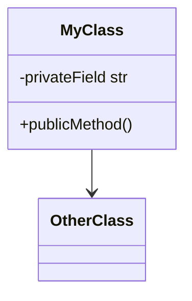

# FAQ - Frequently Asked Questions & Tips

Quick answers to common Claude Code questions.

**Access**: Use `/faq` skill or read this file directly.

---

## Q: How do I scroll up/down in Claude Code terminal without a mouse?

**A:** Use `Ctrl + Shift + Page Up/Down` to scroll in the terminal.

| Action | Shortcut |
|--------|----------|
| Scroll up | `Ctrl + Shift + Page Up` |
| Scroll down | `Ctrl + Shift + Page Down` |

**Why this works**: Claude Code intercepts standard terminal scroll shortcuts, so the `Ctrl + Shift` modifiers are needed. Works in Windows Terminal, PowerShell, and WSL.

---

## Q: How do I view Mermaid diagrams in the live editor?

**A:** Use the `view-mermaid-live.py` script to open diagrams directly in Mermaid Live - **no pasting required!**

### Quick Usage
```bash
python3 ~/.claude/scripts/view-mermaid-live.py diagram.mmd
```

### What It Does
1. Reads your `.mmd` file
2. Encodes diagram directly in the URL (base64)
3. Opens browser with diagram **already loaded**
4. No clipboard, no pasting needed!

### Examples
```bash
# View any Mermaid file - opens with diagram ready!
python3 ~/.claude/scripts/view-mermaid-live.py architecture.mmd
python3 ~/.claude/scripts/view-mermaid-live.py classes.mmd

# Also copy to clipboard as backup
python3 ~/.claude/scripts/view-mermaid-live.py diagram.mmd --copy
```

### How It Works
The script encodes your diagram in the URL:
```
https://mermaid.live/edit#base64:ENCODED_DIAGRAM_JSON
```
Mermaid Live reads the URL and loads the diagram automatically.

**Files**:
- **Script**: `~/klauspython/kc/scripts/view-mermaid-live.py`
- **Symlink**: `~/.claude/scripts/view-mermaid-live.py`

### Mermaid Syntax Tips (avoid errors)

If you get "Syntax error" in Mermaid Live:

| Problem | Wrong | Right |
|---------|-------|-------|
| Underscores in class names | `Coordinate_System` | `CoordinateSystem` |
| Stereotypes | `<<pydantic>>` | Remove or use comment |
| Colon in values | `Domain: Wind_Opt` | `Domain Wind Opt` |
| Special chars | `100%`, `>`, `<` | Avoid or escape |

**Safe template:**

```mermaid
classDiagram
    class MyClass {
        -privateField str
        +publicMethod()
    }
    MyClass --> OtherClass
```

---

## Q: What is the tool for asking multiple choice questions?

**A:** `AskUserQuestion`

This built-in Claude Code tool presents interactive questions with 2-4 options. Users can always select "Other" for custom input.

```
┌─────────────────────────────────────────┐
│ Which database should we use?           │
│ ○ PostgreSQL (Recommended)              │
│ ○ SQLite                                │
│ ○ MongoDB                               │
└─────────────────────────────────────────┘
```

### How to request it
Say to Claude:
- "Ask me before you start coding"
- "Clarify requirements first"
- "Use AskUserQuestion to understand what I want"

### Tips
- Claude can ask **1-4 questions** per AskUserQuestion call
- Each question can have **2-4 options**
- You can always select "Other" for custom input
- Combines well with `--brainstorm` mode for requirements exploration

---

## Q: What are the ★ Insight blocks and where do they come from?

**A:** The `★ Insight` blocks are created by **output style mode plugins**, not by specific agents.

### Active Output Style Plugins
| Plugin | What It Does |
|--------|--------------|
| `explanatory-output-style` | Adds educational insights about code |
| `learning-output-style` | Interactive learning + explanatory (asks you to write key code) |

### How They Work
These plugins use **SessionStart hooks** to inject instructions at the start of each session. The instructions tell Claude to provide insights in this format:

```
`★ Insight ─────────────────────────────────────`
[2-3 key educational points]
`─────────────────────────────────────────────────`
```

### Managing Output Styles
```bash
# List installed plugins
claude plugins list

# Disable a plugin (keeps it installed)
claude plugins disable learning-output-style@claude-code-plugins

# Uninstall completely
claude plugins uninstall learning-output-style@claude-code-plugins
```

### Plugin Location
`~/.claude/plugins/cache/claude-code-plugins/learning-output-style/`

---

## Q: How do I use the /screenshot command?

**A:** `/screenshot` fetches screenshots from your Screenshots folder.

| Command | What it does |
|---------|--------------|
| `/screenshot` | Shows the **latest** (most recent) screenshot |
| `/screenshot 3` | Shows the **last 3** screenshots |
| `/screenshot 2s` | Shows **only** the 2nd most recent (the `s` = "single") |

The `s` suffix gives you ONE specific screenshot at that position, instead of a range.

---

---

## Q: Why don't my inline onclick handlers work? (CSP blocking)

**A:** Content Security Policy (CSP) with `'strict-dynamic'` blocks inline event handlers like `onclick="doSomething()"`.

### The Error
```
Executing inline event handler violates the following Content Security Policy directive
'script-src 'self' 'nonce-xxx' 'strict-dynamic' https:'
```

### Why It Happens
- `'strict-dynamic'` trusts scripts with nonces
- But inline handlers (`onclick`, `onchange`, `onsubmit`) are **NEVER** allowed by nonces
- Nonces only work for `<script>` tags, not attributes

### The Fix
Replace inline handlers with `addEventListener`:

**Before (broken with CSP):**
```html
<button onclick="showScreen('form')">Skjema</button>
```

**After (CSP-compliant):**
```html
<button data-screen="form">Skjema</button>

<script nonce="xxx">
document.querySelectorAll('[data-screen]').forEach(btn => {
    btn.addEventListener('click', function() {
        showScreen(this.getAttribute('data-screen'));
    });
});
</script>
```

### Debugging CSP Issues
1. Open browser DevTools → Console tab
2. Look for "Content Security Policy" errors
3. Check if it's blocking:
   - **Inline handlers** → Use addEventListener instead
   - **External scripts** → Add nonce or add domain to CSP
   - **Inline scripts** → Add nonce to `<script>` tag

### CSP Quick Reference
| CSP Directive | What It Allows |
|---------------|----------------|
| `'nonce-xxx'` | Script tags with matching nonce |
| `'strict-dynamic'` | Scripts loaded by nonced scripts |
| `'unsafe-inline'` | All inline scripts (NOT recommended) |
| `'unsafe-hashes'` | Inline handlers with matching hashes |

**Pro tip**: Use Chrome DevTools MCP (`mcp__chrome-devtools__list_console_messages`) to check for CSP violations!

---

## Q: How do I inject nonces into external scripts for CSP?

**A:** Create a dev server that injects nonces dynamically.

### Example: Python Dev Server with Nonce Injection
```python
# In your HTTP request handler
import secrets
import re

nonce = secrets.token_urlsafe(16)

# Inject nonce into external script tags
html_content = re.sub(
    r'<script src="(https://cdn\.example\.com/[^"]+)">',
    f'<script nonce="{nonce}" src="\\1">',
    html_content
)

# Inject nonce into inline scripts
html_content = re.sub(
    r'<script>',
    f'<script nonce="{nonce}">',
    html_content
)

# Send CSP header with same nonce
csp = f"script-src 'self' 'nonce-{nonce}' 'strict-dynamic' https:"
self.send_header('Content-Security-Policy', csp)
```

### Common CDNs to Nonce
- `cdnjs.cloudflare.com` (Three.js, etc.)
- `cdn.jsdelivr.net` (npm packages)
- `api.mapbox.com` (Mapbox GL JS)
- `maps.googleapis.com` (Google Maps)

### Reference
See `dev-server-with-nonce.py` in Solkraft project for a complete implementation.

---

## Q: Where can I find smart algorithms for common programming problems?

**A:** **LeetCode** (https://leetcode.com) is an excellent source for well-documented, battle-tested algorithms.

### Why LeetCode?
- **Optimized solutions**: Problems have multiple approaches with time/space complexity analysis
- **Real-world applicable**: Many algorithms solve practical problems (image processing, data structures, geometry)
- **Community-vetted**: Solutions are reviewed by millions of developers
- **Discussion sections**: Multiple implementation approaches with explanations

### Useful Algorithm Categories

| Category | Example Problems | Use Cases |
|----------|------------------|-----------|
| **Matrix/Grid** | #85 Maximal Rectangle, #200 Number of Islands | Image analysis, region detection |
| **Geometry** | #587 Erect the Fence (convex hull), #963 Minimum Area Rectangle | Polygon operations, spatial analysis |
| **Intervals** | #56 Merge Intervals, #57 Insert Interval | Scheduling, range operations |
| **Graph** | #743 Network Delay Time, #207 Course Schedule | Dependency analysis, pathfinding |
| **Dynamic Programming** | #322 Coin Change, #1143 Longest Common Subsequence | Optimization problems |

### Example: Using LeetCode #85 in Production

The "Maximal Rectangle" algorithm is used in the Solkraft panel placement module:

```python
# flask_backend/services/pv_design/panel_placement.py
# Uses LeetCode #85 histogram-based approach to find largest viable area

def _find_largest_rectangle(self, mask: np.ndarray):
    """
    Find largest rectangle of True values in binary mask.
    Uses maximal rectangle in histogram algorithm (O(rows × cols)).
    Reference: LeetCode #85
    """
    # Build histogram + stack-based largest rectangle
    ...
```

### How to Search LeetCode

1. **By topic**: https://leetcode.com/problemset/?topicSlugs=array,matrix
2. **By difficulty**: Filter Easy/Medium/Hard
3. **By company**: See which companies ask specific problems
4. **Discussion tab**: Often has better explanations than the official solution

### Pro Tips
- Search for "optimal solution" in discussion for best approaches
- Look for solutions in your preferred language (Python, TypeScript, etc.)
- Check time complexity before implementing
- Many problems have video explanations linked in discussions

---

---

## Q: How do I exit fullscreen mode in Windows Terminal?

**A:** Press **F11** to toggle fullscreen mode on/off.

| Action | Shortcut |
|--------|----------|
| Toggle fullscreen | `F11` |

**Symptoms**: Terminal fills entire screen, no tabs visible at top, no window controls.

**Note**: This works in most Windows applications, not just Windows Terminal.

---

*Last updated: 2026-01-21*
